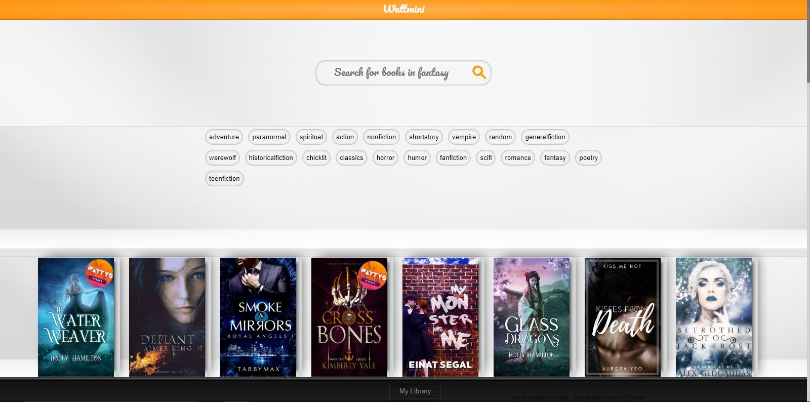
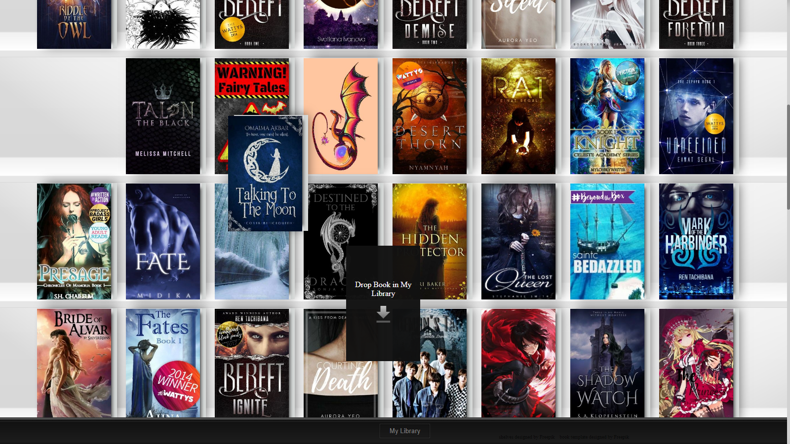
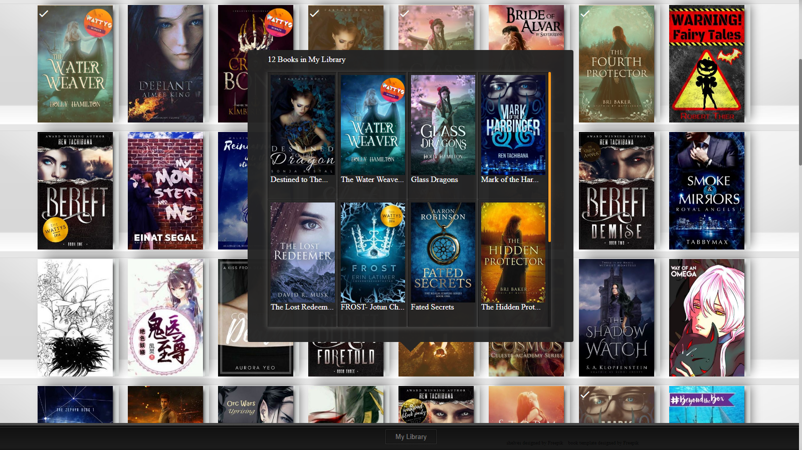
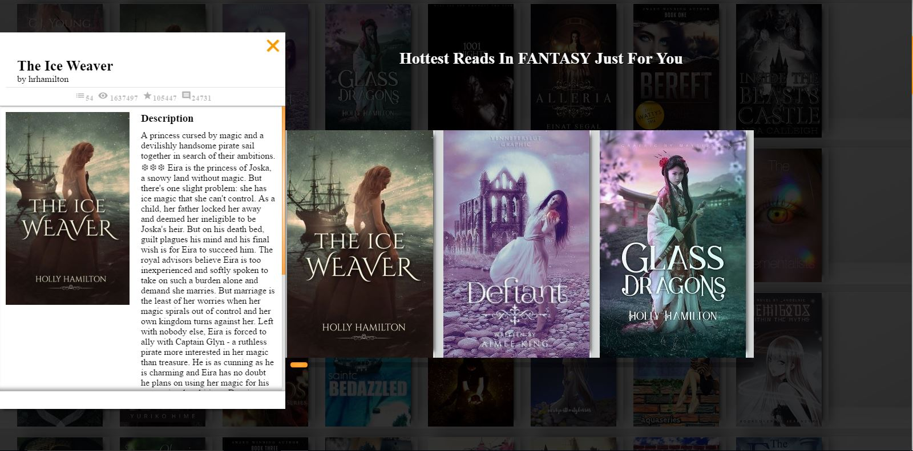

# wattmini

Buying books will become a futuristic experience thanks to my design, which is inspired by Claudio Guglieri's redesign of Netflix.  

Searching for a number of books from any genre is made instant with React's diffing engine, allowing users to stay on a single page.

The jQuery Ui implementation allows users to drag and drop their favorite books.

Browse books in your library smoothly and efficiently.

Clicking on a book will give you access to more detailed information and give you the opportunity to read it(the modal is still under development).
